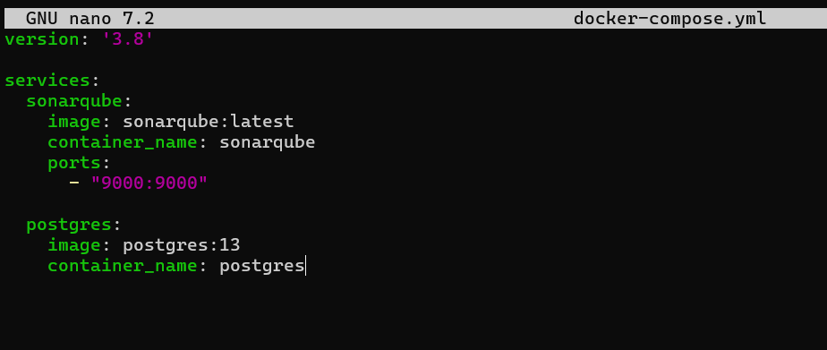
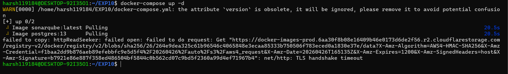
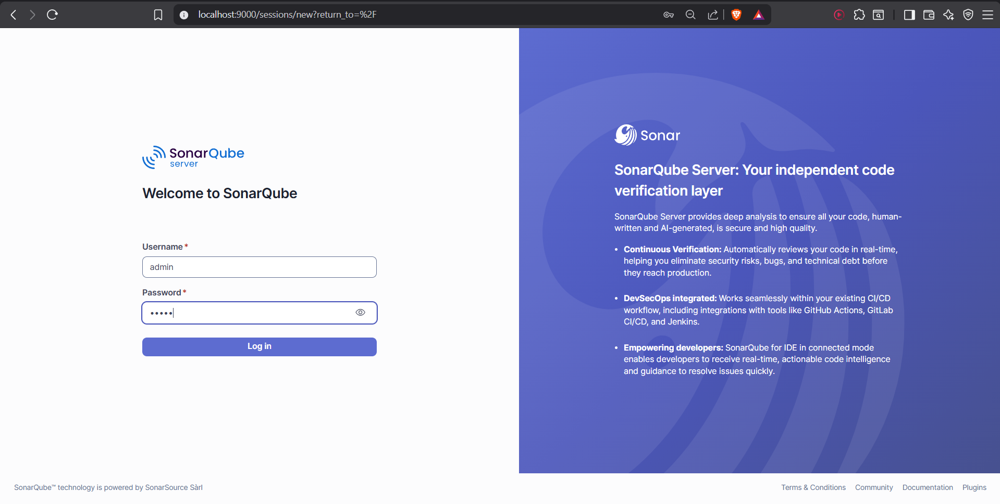
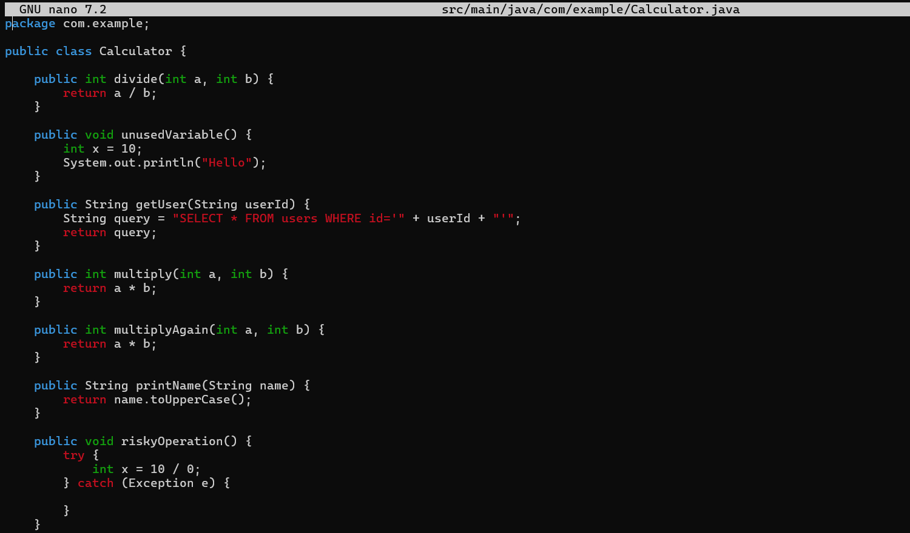
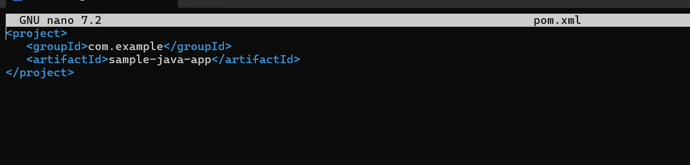
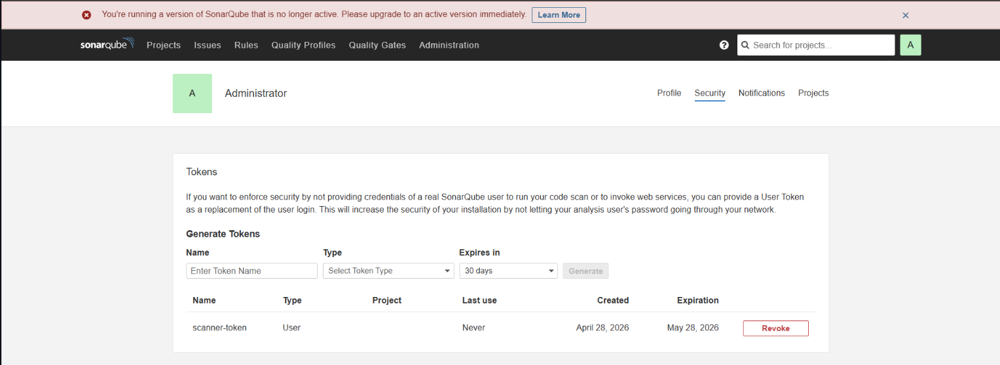
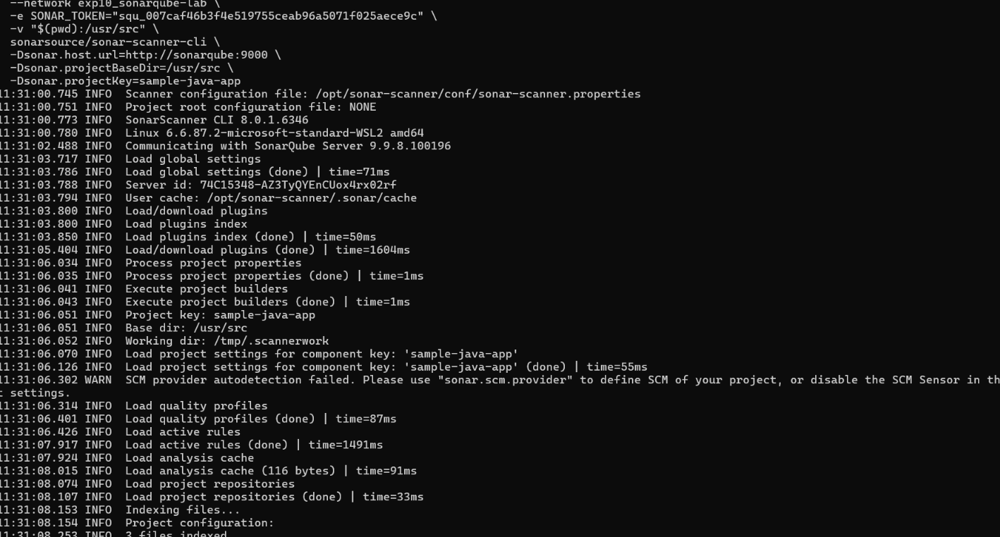
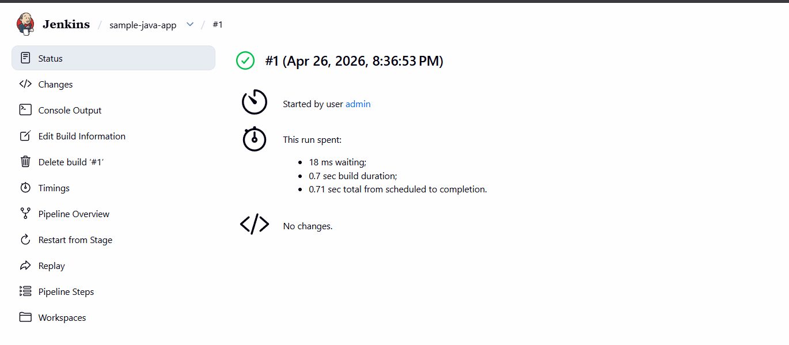

# Lab - Experiment 10

## SonarQube - Static Code Analysis

**Name:** Harsh Vishwakarma 
**SAP ID:** 500119184  
**Batch:** B3 (CCVT)

---

## 1. Aim

To understand SonarQube static code analysis and implement a complete local lab using SonarQube Server, Sonar Scanner, a sample Java application, and token-based authentication.

---

## 2. Theory

### 2.1 Problem Statement

Code bugs and security issues are often found too late during testing or even after deployment. Manual code reviews are slow, inconsistent, and do not scale well as projects grow.

### 2.2 What is SonarQube?

SonarQube is an open-source platform that scans source code for bugs, security vulnerabilities, and maintainability issues without executing the program. This is called static analysis.

### 2.3 How SonarQube Solves the Problem

- Scans code on every commit and gives immediate feedback
- Enforces quality gates before deployment
- Tracks technical debt over time
- Supports many programming languages
- Provides a visual dashboard for trends and issue tracking

### 2.4 Key Terms

| Term | Meaning |
|---|---|
| Quality Gate | A set of rules that code must pass before deployment |
| Bug | Code that will likely fail or behave incorrectly |
| Vulnerability | A security weakness in the code |
| Code Smell | Code that works but is poorly written or hard to maintain |
| Technical Debt | Estimated time required to fix all issues |
| Coverage | Percentage of code covered by tests |
| Duplication | Repeated code blocks |

### 2.5 Lab Architecture

SonarQube has two main parts:

- SonarQube Server: stores results, applies rules, and shows the dashboard
- Sonar Scanner: reads source code and sends analysis results to the server

```text
┌─────────────────────────────────────────────────────────┐
│                    Your Machine / CI                   │
│                                                        │
│   ┌──────────────┐        ┌──────────────────────────┐  │
│   │   Your Code  │──────▶ │    Sonar Scanner        │  │
│   │ (Java, JS,   │ scans  │ (CLI / Maven / Jenkins) │  │
│   │  Python...)  │        └────────────┬─────────────┘  │
│   └──────────────┘                     │ sends report   │
│                                        ▼                │
│                          ┌─────────────────────────┐    │
│                          │   SonarQube Server      │    │
│                          │   (runs on port 9000)   │    │
│                          │   ┌─────────────────┐   │    │
│                          │   │ Analysis Engine │   │    │
│                          │   │ Quality Gates   │   │    │
│                          │   │ Web Dashboard   │   │    │
│                          │   └────────┬────────┘   │    │
│                          └───────────┼─────────────┘    │
│                                      │ stores results   │
│                          ┌───────────▼─────────────┐    │
│                          │   PostgreSQL Database   │    │
│                          └─────────────────────────┘    │
└─────────────────────────────────────────────────────────┘
```

### 2.6 Why Both Are Required

- Only the server installed: no code gets analyzed and the dashboard stays empty
- Only the scanner installed: there is nowhere to send results
- Both together: the full pipeline works

### 2.7 How the Token Works

The scanner does not use a username and password. It uses a token generated from the SonarQube web UI.

Token flow:

1. Start the SonarQube server
2. Open the web UI at `http://localhost:9000`
3. Generate a token in your account settings
4. Pass the token to the scanner
5. The server validates the token and stores the analysis results
6. View the dashboard

---

## 3. Hands-on Lab

### 3.1 Project Structure

The experiment uses a Docker Compose setup for SonarQube and PostgreSQL, along with a sample Java project that contains deliberate code issues for analysis.

### 3.2 Start the SonarQube Server

The server is started with Docker Compose.

```yaml
# docker-compose.yml
version: '3.8'

services:
  sonar-db:
    image: postgres:13
    container_name: sonar-db
    environment:
      POSTGRES_USER: sonar
      POSTGRES_PASSWORD: sonar
      POSTGRES_DB: sonarqube
      POSTGRES_HOST_AUTH_METHOD: trust
    volumes:
      - sonar-db-data:/var/lib/postgresql/data
    networks:
      - sonarqube-lab

  sonarqube:
    image: sonarqube:lts-community
    container_name: sonarqube
    ports:
      - "9000:9000"
    environment:
      SONAR_JDBC_URL: jdbc:postgresql://sonar-db:5432/sonarqube
      SONAR_JDBC_USERNAME: sonar
      SONAR_JDBC_PASSWORD: sonar
    volumes:
      - sonar-data:/opt/sonarqube/data
      - sonar-extensions:/opt/sonarqube/extensions
    depends_on:
      - sonar-db
    networks:
      - sonarqube-lab

volumes:
  sonar-db-data:
  sonar-data:
  sonar-extensions:

networks:
  sonarqube-lab:
    driver: bridge
```

Run the containers:

```bash
docker-compose up -d
docker-compose logs -f sonarqube
```




After the server starts, open:

```text
http://localhost:9000
```

Default login:

```text
admin / admin
```



### 3.3 Create a Sample Java App with Code Issues

The sample app contains intentional defects so SonarQube can detect issues such as bugs, vulnerabilities, and code smells.

```java
package com.example;

public class Calculator {

    public int divide(int a, int b) {
        return a / b;
    }

    public int add(int a, int b) {
        int result = a + b;
        int unused = 100;
        return result;
    }

    public String getUser(String userId) {
        String query = "SELECT * FROM users WHERE id = " + userId;
        return query;
    }

    public int multiply(int a, int b) {
        int result = 0;
        for (int i = 0; i < b; i++) {
            result = result + a;
        }
        return result;
    }

    public int multiplyAlt(int a, int b) {
        int result = 0;
        for (int i = 0; i < b; i++) {
            result = result + a;
        }
        return result;
    }

    public String getName(String name) {
        return name.toUpperCase();
    }

    public void riskyOperation() {
        try {
            int x = 10 / 0;
        } catch (Exception e) {
        }
    }
}
```



The Maven project is configured with SonarQube properties and the Maven scanner plugin.

```xml
<properties>
    <maven.compiler.source>11</maven.compiler.source>
    <maven.compiler.target>11</maven.compiler.target>
    <sonar.projectKey>sample-java-app</sonar.projectKey>
    <sonar.host.url>http://localhost:9000</sonar.host.url>
    <sonar.login>YOUR_TOKEN_HERE</sonar.login>
</properties>
```



### 3.4 Generate a Token

The scanner uses a token for authentication. This token is generated manually from the SonarQube UI.

Steps:

1. Open `http://localhost:9000`
2. Log in as `admin`
3. Click the user icon and open `My Account`
4. Open the `Security` tab
5. Under `Generate Tokens`, enter a name such as `scanner-token`
6. Click `Generate`
7. Copy the token immediately because it is shown only once



### 3.5 Run the Scanner

For Java projects, the Maven-based scan is the simplest option.

```bash
cd sample-java-app
mvn sonar:sonar -Dsonar.login=YOUR_TOKEN
```

You can also run the scanner with Docker CLI if required.

```bash
docker run --rm \
  --network sonarqube-lab \
  -e SONAR_TOKEN="YOUR_TOKEN" \
  -v "$(pwd):/usr/src" \
  sonarsource/sonar-scanner-cli \
  -Dsonar.host.url=http://sonarqube:9000 \
  -Dsonar.projectBaseDir=/usr/src \
  -Dsonar.projectKey=sample-java-app
```



### 3.6 View Results in the Dashboard

After the scan completes, open the project dashboard:

```text
http://localhost:9000/dashboard?id=sample-java-app
```

You should see bugs, vulnerabilities, code smells, coverage, duplication, and technical debt metrics in the dashboard.



### 3.7 Integrate with Jenkins

SonarQube can be integrated into a Jenkins pipeline so every commit is analyzed automatically.

```groovy
pipeline {
    agent any

    environment {
        SONAR_HOST_URL = 'http://sonarqube:9000'
        SONAR_TOKEN = credentials('sonar-token')
    }

    stages {
        stage('Checkout') {
            steps {
                checkout scm
            }
        }

        stage('SonarQube Analysis') {
            steps {
                withSonarQubeEnv('SonarQube') {
                    sh 'mvn clean verify sonar:sonar'
                }
            }
        }

        stage('Quality Gate') {
            steps {
                timeout(time: 5, unit: 'MINUTES') {
                    waitForQualityGate abortPipeline: true
                }
            }
        }

        stage('Build') {
            steps {
                sh 'mvn package'
            }
        }

        stage('Deploy') {
            steps {
                sh 'docker build -t sample-app .'
                sh 'docker run -d -p 8080:8080 sample-app'
            }
        }
    }
}
```

---

## 4. Token Generation Summary

| Step | Action |
|---|---|
| 1 | Start SonarQube server |
| 2 | Open the web UI |
| 3 | Generate a token from the Security tab |
| 4 | Copy the token immediately |
| 5 | Pass it to Maven or the scanner CLI |
| 6 | Run the analysis |
| 7 | Review the dashboard |

---

## 5. Comparative Analysis & Summary

| Tool | Primary Purpose | Architecture | Main Use |
|---|---|---|---|
| Jenkins | CI/CD orchestration | Master-agent | Build, test, deploy |
| Ansible | Configuration management | Agentless | Infrastructure automation |
| Chef | Configuration management | Client-server | Large-scale system management |
| SonarQube | Code quality analysis | Server + scanner | Static code analysis |

SonarQube is the analysis platform that stores and displays results. The scanner reads the code and sends the analysis report to the server. Both are required, and the token is used to authenticate the scanner with the SonarQube server.

---

## 6. Commands Quick Reference

```bash
# Start SonarQube stack
docker-compose up -d

# View SonarQube logs
docker-compose logs -f sonarqube

# Run Maven scan
cd sample-java-app
mvn sonar:sonar -Dsonar.login=YOUR_TOKEN

# Run scanner with Docker
docker run --rm \
  --network sonarqube-lab \
  -e SONAR_TOKEN="YOUR_TOKEN" \
  -v "$(pwd):/usr/src" \
  sonarsource/sonar-scanner-cli \
  -Dsonar.host.url=http://sonarqube:9000 \
  -Dsonar.projectBaseDir=/usr/src \
  -Dsonar.projectKey=sample-java-app

# Query issues through the API
curl -u admin:YOUR_TOKEN \
  "http://localhost:9000/api/issues/search?projectKeys=sample-java-app&types=BUG"
```

---

## 7. Best Practices

- Never hardcode tokens or passwords in source files
- Use HTTPS for SonarQube communications in production
- Scan every pull request instead of waiting for nightly runs
- Set quality gates to block bad code from being merged
- Fix issues early to keep technical debt low
- Version all configuration files in Git

---

## 8. Conclusion

This experiment demonstrated how SonarQube performs static code analysis using a server, scanner, and token-based authentication. The SonarQube dashboard makes code quality visible, while quality gates help prevent low-quality code from moving further in the delivery pipeline.
