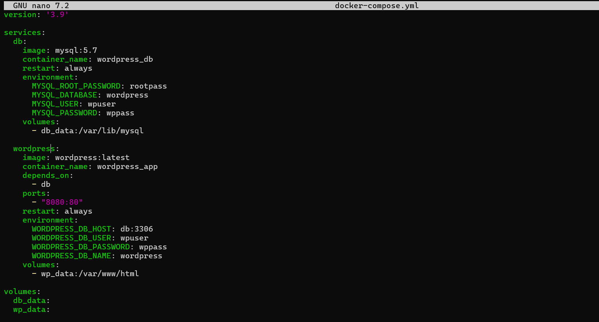
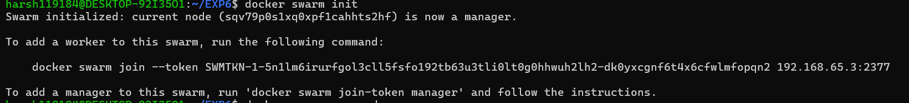
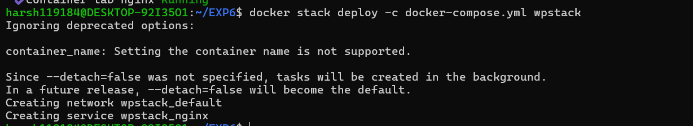
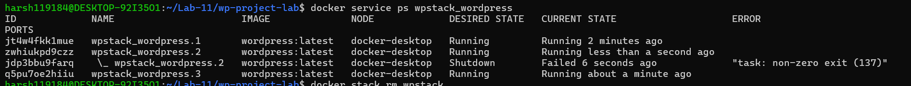
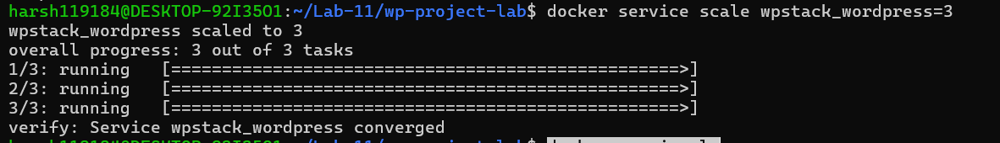
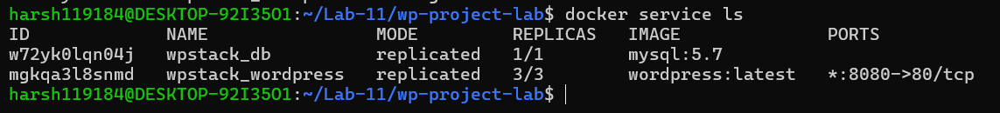
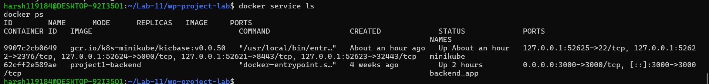

# Lab - Experiment 11

## Orchestration using Docker Compose and Docker Swarm

**Name:** Harsh Vishwakarma  
**SAP ID:** 500119184  
**Batch:** B3 (CCVT)

---

## 1. Aim

To understand the progression from Docker Run to Docker Compose and Docker Swarm, and to extend the WordPress + MySQL setup from Experiment 6 using Swarm features such as scaling and self-healing.

---

## 2. Theory

### 2.1 Problem Statement

Running containers manually works for a single service, but real applications usually contain multiple components. Docker Compose helps manage multi-container applications on one machine, but it does not provide clustering, built-in self-healing, or service-level orchestration.

### 2.2 What is Orchestration?

Orchestration is the automatic management of containers.

It helps with:

- Scaling containers up or down
- Replacing failed containers automatically
- Balancing traffic across replicas
- Managing services instead of individual containers

### 2.3 Progression Path

```text
docker run  ->  Docker Compose  ->  Docker Swarm  ->  Kubernetes
   |                |                   |                |
Single         Multi-container      Basic orches-     Advanced
container         single-host        tration          orchestration
```

This experiment focuses on the transition from Docker Compose to Docker Swarm.

### 2.4 Compose vs Swarm at a Glance

| Feature | Docker Compose | Docker Swarm |
|---|---|---|
| Scope | Single host | Multi-node cluster |
| Scaling | Manual or limited | Built-in service scaling |
| Self-healing | No | Yes |
| Load balancing | No | Yes |
| Service discovery | Basic | Built-in |
| Use case | Development and testing | Simple production orchestration |

### 2.5 Why Swarm Matters

Swarm adds service management on top of Compose-style application definitions. Instead of managing one container at a time, you manage services that can be scaled and recovered automatically.

---

## 3. Part A - Concept Continuation

### 3.1 From Experiment 6 to Experiment 11

From Experiment 6, the WordPress and MySQL application was deployed with Docker Compose. That setup worked well for a single machine, but it still relied on manual lifecycle management.

The next step is Docker Swarm:

- Compose defines the application
- Swarm runs it as orchestrated services
- The same YAML structure can be reused

### 3.2 What Orchestration Adds

| Feature | What it Means |
|---|---|
| Scaling | Increase or decrease the number of running replicas |
| Self-healing | Restart or replace failed tasks automatically |
| Load balancing | Spread requests across running replicas |
| Multi-host support | Run services on a cluster of machines |

### 3.3 Learning Flow

1. Check the current Docker state
2. Initialize Swarm on the machine
3. Deploy the Compose file as a stack
4. Verify services and tasks
5. Access the application in the browser
6. Scale the WordPress service
7. Test automatic recovery
8. Remove the stack

---

## 4. Part B - Practical

### 4.1 Prerequisites

- Docker installed and running
- The WordPress + MySQL Compose file from Experiment 6
- Docker Swarm mode available on the system

### 4.2 Experiment 6 Compose File

The same Compose definition can be reused in Swarm.

```yaml
version: '3.9'

services:
  db:
    image: mysql:5.7
    container_name: wordpress_db
    restart: always
    environment:
      MYSQL_ROOT_PASSWORD: rootpass
      MYSQL_DATABASE: wordpress
      MYSQL_USER: wpuser
      MYSQL_PASSWORD: wppass
    volumes:
      - db_data:/var/lib/mysql

  wordpress:
    image: wordpress:latest
    container_name: wordpress_app
    depends_on:
      - db
    ports:
      - "8080:80"
    restart: always
    environment:
      WORDPRESS_DB_HOST: db:3306
      WORDPRESS_DB_USER: wpuser
      WORDPRESS_DB_PASSWORD: wppass
      WORDPRESS_DB_NAME: wordpress
    volumes:
      - wp_data:/var/www/html

volumes:
  db_data:
  wp_data:
```



### 4.3 Task 1: Check Current State

Before enabling Swarm, stop any existing Compose deployment.

```bash
docker compose down -v
docker ps
```

This ensures no previous WordPress or MySQL containers are still running.

### 4.4 Task 2: Initialize Docker Swarm

Initialize Swarm on the current machine.

```bash
docker swarm init
docker node ls
```



Expected result:

- The machine becomes a Swarm manager
- The node appears as `Ready` and `Leader`

### 4.5 Task 3: Deploy as a Stack

Deploy the WordPress application as a Swarm stack.

```bash
docker stack deploy -c docker-compose.yml wpstack
```



In Swarm, this creates services instead of plain containers.

### 4.6 Task 4: Verify the Deployment

List the deployed services.

```bash
docker service ls
docker service ps wpstack_wordpress
```




The service name includes the stack name, so the WordPress service appears as `wpstack_wordpress`.

### 4.7 Task 5: Access WordPress

Open the browser and access the WordPress application.

```text
http://localhost:8080
```

The setup screen should appear exactly as it did in Experiment 6, but now the deployment is managed by Swarm.

### 4.8 Task 6: Scale the Application

One of Swarm’s main strengths is scaling services.

```bash
docker service scale wpstack_wordpress=3
docker service ls
docker service ps wpstack_wordpress
```





After scaling, three WordPress tasks should be running.

### 4.9 What Just Happened?

Before scaling, there was one WordPress container.
After scaling, there are three replicas of the WordPress service.

Swarm handles the traffic internally, so the application is still available on the same host port.

### 4.10 Task 7: Test Self-Healing

Swarm automatically replaces failed tasks.

```bash
docker ps
docker kill <container-id>
docker service ps wpstack_wordpress
```




When one WordPress task is killed, Swarm creates a replacement task automatically.

### 4.11 Task 8: Remove the Stack

Clean up the application after testing.

```bash
docker stack rm wpstack
docker service ls
docker ps
```

This removes the stack, services, and Swarm-managed containers.

---

## 5. Analysis

### 5.1 Compose vs Swarm

| Aspect | Docker Compose | Docker Swarm |
|---|---|---|
| Deployment style | `docker compose up` | `docker stack deploy` |
| Resource unit | Container | Service and task |
| Scaling | Basic | Native service scaling |
| Recovery | Manual | Automatic |
| Load balancing | Limited | Built-in |
| Best for | Development | Simple orchestration |

### 5.2 Important Observations

- The same Compose file can be used in Swarm with stack deployment
- In Swarm, you manage services rather than containers
- Scaling WordPress does not require changing the browser URL
- Swarm automatically recreates failed tasks
- Swarm is a natural progression from Compose before moving to Kubernetes

---

## 6. Summary

Docker Compose is useful for defining and running multi-container applications on one machine. Docker Swarm extends that idea by adding orchestration, scaling, self-healing, and service management.

---

## 7. Quick Reference Card

```bash
# Stop old Compose deployment
docker compose down -v

# Initialize Swarm
docker swarm init

# Deploy stack
docker stack deploy -c docker-compose.yml wpstack

# List services
docker service ls

# View service tasks
docker service ps wpstack_wordpress

# Scale service
docker service scale wpstack_wordpress=3

# Kill a container to test recovery
docker kill <container-id>

# Remove stack
docker stack rm wpstack
```

---

## 8. Result

The WordPress + MySQL application from Experiment 6 was successfully extended into Docker Swarm. The stack was deployed, verified, scaled, tested for self-healing, and removed using Swarm commands.

---

## 9. Conclusion

This experiment demonstrates the progression from Docker Compose to Docker Swarm. Compose defines the application, while Swarm runs it as orchestrated services with scaling and recovery features that are not available in plain Compose.