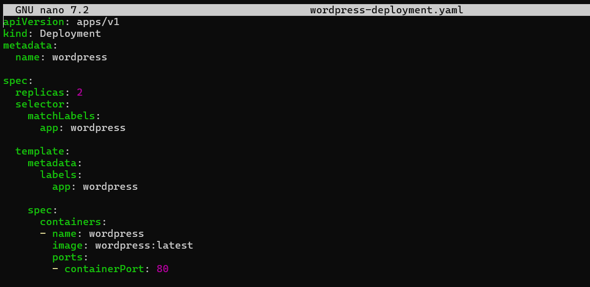
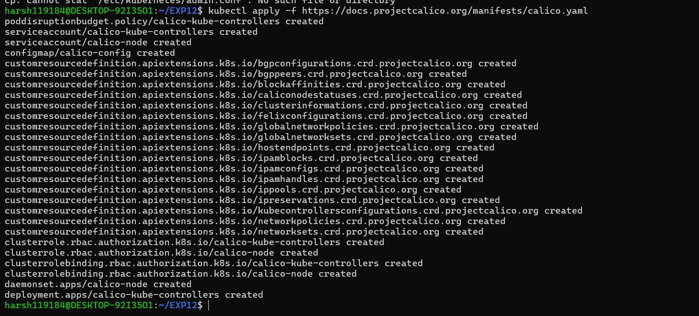
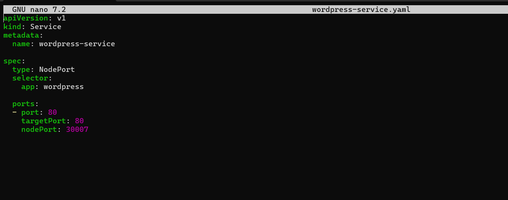
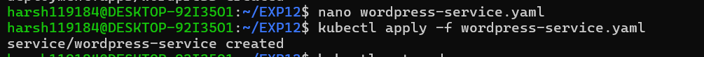
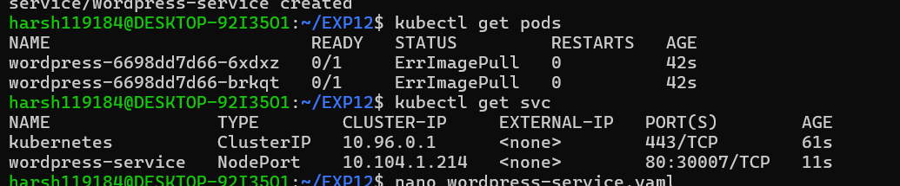
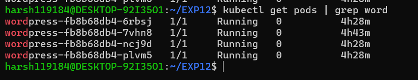
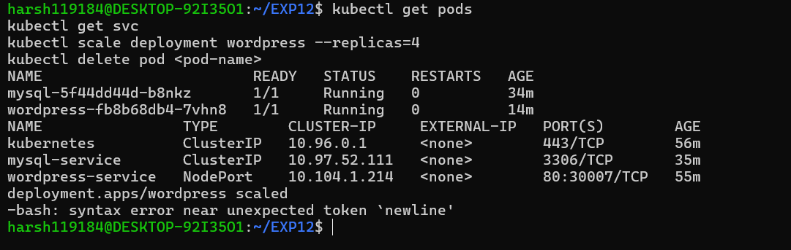
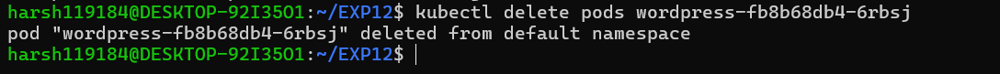

# Lab - Experiment 12

## Container Orchestration using Kubernetes

**Name:** Harsh Vishwakarma  
**SAP ID:** 500119184  
**Batch:** B3 (CCVT)

---

## 1. Aim

To understand Kubernetes as a container orchestration platform, learn core concepts, deploy and scale applications, and compare Kubernetes with Docker Swarm.

---

## 2. Theory

### 2.1 Problem Statement

Docker Swarm provides basic orchestration for multi-node clusters, but lacks the advanced scheduling, auto-scaling, and ecosystem support that modern cloud-native applications require. Many organizations need a more robust, industry-standard orchestration solution.

### 2.2 What is Kubernetes?

Kubernetes (K8s) is an open-source container orchestration platform that automates the deployment, scaling, and management of containerized applications.

Key characteristics:

- Declarative configuration using YAML manifests
- Automatic scheduling of containers across nodes
- Self-healing and auto-scaling capabilities
- Cloud-native and multi-cloud support
- Large ecosystem of tools and plugins

### 2.3 Why Kubernetes over Docker Swarm?

| Reason | Explanation |
|---|---|
| Industry standard | Most companies use Kubernetes |
| Powerful scheduling | Automatically decides where to run your app based on resource requirements |
| Large ecosystem | Many tools for monitoring, logging, service mesh, and more |
| Cloud-native support | Works seamlessly on AWS, Google Cloud, Azure, and on-premises |
| Advanced features | Auto-scaling, rolling updates, canary deployments, and health checks |

### 2.4 Core Kubernetes Concepts

| Docker Concept | Kubernetes Equivalent | Meaning |
|---|---|---|
| Container | Pod | Smallest unit in K8s; one or more containers in a network namespace |
| Docker Compose service | Deployment | Describes desired application state (replicas, image, restart policy) |
| Load balancing | Service | Exposes pods internally or externally; stable IP and DNS |
| Replicas | ReplicaSet | Ensures desired number of pod copies are always running |
| Node | Node | Physical or virtual machine running pods |

### 2.5 Key Components

- **Control Plane (Master):** Makes decisions about the cluster (scheduling, scaling, monitoring)
- **Worker Nodes:** Run containers in pods
- **Pods:** Smallest deployable unit (wraps one or more containers)
- **Deployments:** Declarative update mechanism for pods and ReplicaSets
- **Services:** Expose pods to network traffic
- **ConfigMaps & Secrets:** Store configuration and sensitive data

### 2.6 Benefits of Kubernetes

- Automatic scaling based on resource usage
- Self-healing: automatic restart and replacement of failed pods
- Rolling updates with zero downtime
- Declarative infrastructure as code
- Multi-node high availability
- Works on any cloud or on-premises
- Strong community and enterprise support

---

## 3. Part A – Hands-On Lab (Using k3d or Minikube)

### 3.1 Prerequisites

Before starting, ensure you have:

- kubectl installed
- A Kubernetes cluster (k3d, Minikube, or kubeadm-based)
- Docker or container runtime

---

## 4. Task 1: Create a Deployment

A Deployment tells Kubernetes which image to run, how many replicas to maintain, and how to identify pods.

### 4.1 Create the Deployment YAML File

```yaml
# wordpress-deployment.yaml
apiVersion: apps/v1          # Which Kubernetes API to use
kind: Deployment             # Type of resource
metadata:
  name: wordpress            # Name of this deployment
spec:
  replicas: 2                # Run 2 identical pods
  selector:
    matchLabels:
      app: wordpress         # Pods with this label belong to this deployment
  template:                  # Template for the pods
    metadata:
      labels:
        app: wordpress       # Label applied to each pod
    spec:
      containers:
      - name: wordpress
        image: wordpress:latest   # Docker image
        ports:
        - containerPort: 80       # Port inside the container
```



### 4.2 Apply the Deployment

```bash
kubectl apply -f wordpress-deployment.yaml
```



Kubernetes creates 2 pods running WordPress automatically.

#### Why this step matters

Deployments are the standard way to manage stateless applications in Kubernetes. The desired state (2 replicas) is automatically maintained.

---

## 5. Task 2: Expose the Deployment as a Service

Pods are ephemeral and get new IP addresses when recreated. A Service provides a stable endpoint for accessing your application.

### 5.1 Create the Service YAML File

```yaml
# wordpress-service.yaml
apiVersion: v1
kind: Service
metadata:
  name: wordpress-service
spec:
  type: NodePort            # Exposes service on a port of each node (VM)
  selector:
    app: wordpress          # Send traffic to pods with this label
  ports:
    - port: 80              # Service port
      targetPort: 80        # Pod port
      nodePort: 30007       # External port (range: 30000–32767)
```



### 5.2 Apply the Service

```bash
kubectl apply -f wordpress-service.yaml
```



The Service is now exposed on port 30007 of any node in the cluster.

#### Why this step matters

Services decouple the application from individual pods. Traffic is automatically load-balanced across all pods matching the selector label.

---

## 6. Task 3: Verify Everything

### 6.1 Check if Pods are Running

```bash
kubectl get pods
```

Expected output:

```text
NAME                          READY   STATUS    RESTARTS   AGE
wordpress-xxxxx-yyyyy         1/1     Running   0          2m
wordpress-xxxxx-zzzzz         1/1     Running   0          2m
```



### 6.2 Check the Service

```bash
kubectl get svc
```

Expected output:

```text
NAME                TYPE       CLUSTER-IP     EXTERNAL-IP   PORT(S)        AGE
wordpress-service   NodePort   10.43.x.x      <none>        80:30007/TCP   1m
kubernetes          ClusterIP  10.43.0.1      <none>        443/TCP        10m
```


### 6.3 Access Your Application

Find the node IP and access WordPress in your browser:

```
http://<node-ip>:30007
```

For k3d: typically `localhost:30007`  
For Minikube: run `minikube ip` to find the IP

#### Why this step matters

Verification confirms the deployment, service, and networking are all working correctly.

---

## 7. Task 4: Scale the Deployment

Increase the number of pods from 2 to 4:

```bash
kubectl scale deployment wordpress --replicas=4
```



### 7.1 Verify the Scaling

```bash
kubectl get pods
```

You should now see 4 running WordPress pods.



#### Why scale?

- More traffic requires more replicas
- Better performance and availability
- Kubernetes can also do this automatically (Horizontal Pod Autoscaler)

#### Why this step matters

Scaling in Kubernetes is declarative and automatic. You simply declare the desired number of replicas, and Kubernetes ensures exactly that many pods are running.

---

## 8. Task 5: Self-Healing Demonstration

Kubernetes automatically replaces failed pods.

### 8.1 Delete One Pod Manually

```bash
# First, list pods
kubectl get pods

# Delete one (replace <pod-name>)
kubectl delete pod <pod-name>
```



### 8.2 Observe Auto-Replacement

```bash
kubectl get pods
```

Even after deletion, you still see 4 pods running.


#### Why this step matters

Self-healing is a key feature. The Deployment constantly monitors the number of running pods and automatically creates replacements if any fail. This is how Kubernetes maintains high availability without manual intervention.

---

## 9. Part B – Swarm vs Kubernetes Comparison

| Feature | Docker Swarm | Kubernetes |
|---|---|---|
| Setup Complexity | Very easy | More complex |
| Scaling | Basic (manual scale) | Advanced (auto-scaling) |
| Self-Healing | Simple | Advanced with health checks |
| Ecosystem | Small | Huge (monitoring, logging, service mesh) |
| Industry Adoption | Rare | Standard (most companies) |
| Load Balancing | Built-in | Built-in with more options |
| Storage | Limited | Rich (PersistentVolumes, StatefulSets) |
| Updates | Rolling updates | Canary, blue-green deployments |

**Verdict:** For production use, Kubernetes is the industry standard. Learn it for modern cloud-native development.

---


## 10. When to Use Which Tool?

| Tool | Best Use Case |
|---|---|
| **k3d** | Quick learning and testing on your laptop |
| **Minikube** | Single-node cluster for development and testing |
| **kubeadm** | Real, multi-node, production-style cluster |
| **Managed K8s (EKS, GKE, AKS)** | Production-grade clusters on cloud |

---

## 11. Summary of Commands (Cheat Sheet)

| Task | Command |
|---|---|
| Apply YAML manifest | `kubectl apply -f file.yaml` |
| See all pods | `kubectl get pods` |
| See all services | `kubectl get svc` |
| See all nodes | `kubectl get nodes` |
| See pod details | `kubectl describe pod <pod-name>` |
| View pod logs | `kubectl logs <pod-name>` |
| Scale deployment | `kubectl scale deployment <name> --replicas=N` |
| Delete a pod | `kubectl delete pod <pod-name>` |
| Delete deployment | `kubectl delete deployment <name>` |
| Get cluster info | `kubectl cluster-info` |
| Watch pods (live) | `kubectl get pods -w` |

---

## 12. Observations

- Kubernetes uses declarative YAML manifests to define desired state
- Deployments automatically maintain the desired number of replicas
- Services provide stable networking endpoints for pods
- Self-healing is automatic — failed pods are replaced immediately
- Scaling is simple: declare the desired number of replicas
- The control plane continuously monitors and adjusts the cluster state
- Kubernetes is more complex than Docker Swarm but offers powerful production features

---

## 13. Result

Successfully demonstrated Kubernetes fundamentals including:

- Created a Deployment for WordPress with 2 replicas
- Exposed the Deployment via a Service (NodePort)
- Verified pods and services are running and accessible
- Scaled the Deployment from 2 to 4 replicas
- Demonstrated self-healing by deleting a pod and observing automatic replacement
- Learned the conceptual differences between Kubernetes and Docker Swarm
- Understood the steps for building a real multi-node cluster using kubeadm

---

## 14. Conclusion

Kubernetes is the industry-standard container orchestration platform. While more complex than Docker Swarm, it provides powerful features like advanced scheduling, auto-scaling, self-healing, and a rich ecosystem of tools.

This experiment covered basic Kubernetes concepts through hands-on deployment, scaling, and failure recovery. For production use, Kubernetes is the right choice. The declarative model, automatic operation, and cloud-native integration make it essential for modern application deployment.

Next steps: Explore StatefulSets for databases, ConfigMaps and Secrets for configuration, and ingress controllers for external traffic management.
